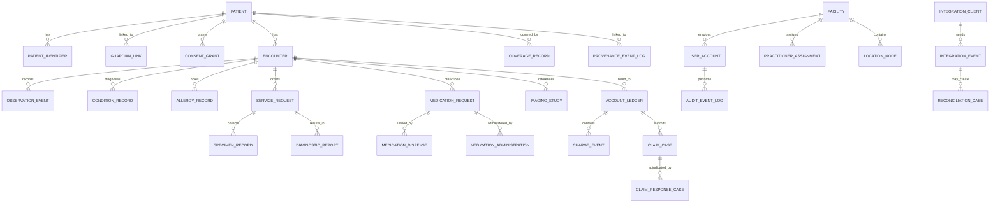
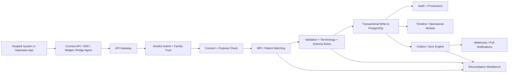
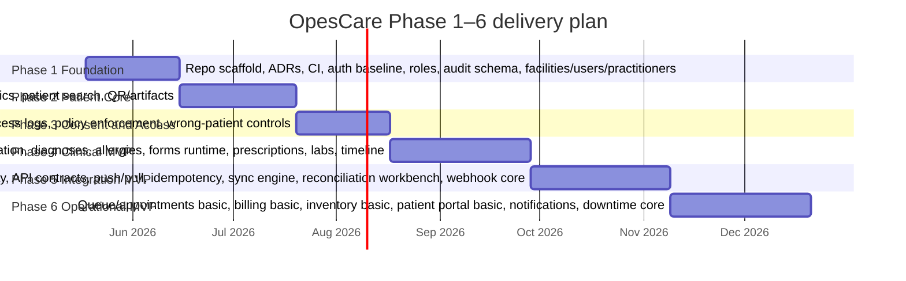

# OpesCare Validated Project Knowledge

## Executive summary

OpesCare should be treated as a **patient-centered digital health identity, interoperability, and care-operations platform**, not as a generic hospital CRUD application. The strongest technical baseline remains a **Laravel modular monolith** for transactional workflows, **PostgreSQL** as the system of record, **Redis** for cache/queues/event buffering, and **Python services** only where probabilistic matching, OCR, analytics, or future clinical intelligence are actually needed. Laravel’s official documentation explicitly supports authentication, authorization policies, queues, validation, filesystem abstraction, and database transactions; PostgreSQL provides UUID support and ACID transactions; Redis supports append-only stream/log patterns and persistence, which is useful for asynchronous sync and webhook delivery but should not become the canonical clinical datastore. citeturn1search0turn1search1turn1search2turn1search3turn7search2turn7search3turn2search0turn2search1turn2search2turn2search3

For interoperability, OpesCare should be **FHIR R4-aligned at the boundary**, not implemented as a raw FHIR server from day one. FHIR already models the exact concepts OpesCare needs as separate resources: Patient, Encounter, Consent, Observation, DiagnosticReport, MedicationRequest, MedicationDispense, Coverage, Claim, ClaimResponse, AuditEvent, Provenance, Appointment, Schedule, Slot, Questionnaire, QuestionnaireResponse, and related resources. That structure matches the event-oriented longitudinal record OpesCare needs, and it avoids the dangerous anti-pattern of a single giant mutable “patient record” document. FHIR’s permanent R4 publication remains available, while US Core remains R4-based, making R4 the practical semantic baseline for exchange contracts. citeturn4search0turn0search0turn8view0turn9view0turn13view1turn9view2turn9view1turn13view4turn9view4turn9view5turn9view6turn9view7turn9view8turn10view0turn11view0turn11view1turn14view0turn15view0turn6search3

Validation against the previously defined modules, the earlier 48 operational flows, and the later QA/integration sections surfaces **four mandatory missing modules** that must be added to make the knowledge model complete: **Family, Guardian, and Dependent Management**; **Clinical Forms and Questionnaire Management**; **Terminology and Coding Services**; and **Reconciliation and Data Integrity Workbench**. This revision also closes the major known bug classes identified earlier: duplicate patient creation across entry points, unclear provisional-patient lifecycle, unknown emergency patient handling, emergency-care billing blockage, stale offline consent reuse, silent edit of released lab results, partial-dispense cancellation errors, claim lifecycle gaps, referral-access expiry gaps, stock recall and expiry dispensing risks, integrator overexposure, webhook leakage, minor-to-adult transition failures, and configuration-version drift. Country-specific items that are still unknown are made explicitly configurable rather than implicitly guessed.

For API security and partner interoperability, OpesCare should standardize on **OAuth 2.0 bearer tokens**, require **PKCE** for public/native patient apps, add **OpenID Connect** only where identity federation is needed, and describe all external HTTP contracts in **OpenAPI 3.1**. Bearer tokens must be protected in storage and transport; PKCE is specifically intended to mitigate authorization-code interception for public clients; and OpenAPI provides the machine-readable, language-agnostic API contract needed for SDK generation, certification, and partner integration. citeturn0search2turn3search0turn3search1turn3search6turn3search9turn0search7turn0search15turn7search1turn7search0

## Standards baseline and architecture rules

**Standards baseline**

OpesCare should adopt the following standards posture:

- **FHIR R4 semantic baseline for external exchange**. Use FHIR resource semantics as the canonical interoperability language for identity, encounters, consent, observations, reports, medications, claims, audit, provenance, scheduling, forms, and research. R4 is the practical external baseline because it is permanently published and is still the base for widely used implementation guides such as US Core. citeturn4search0turn6search3turn0search16turn4search3
- **OAuth 2.0 + bearer token protection + PKCE + optional OIDC**. Use OAuth 2.0 and bearer-token rules for partner/system APIs; require PKCE for mobile/public patient clients; use OIDC only when OpesCare must federate identity with third-party IdPs. citeturn0search2turn3search0turn3search1turn3search6turn3search9turn3search13
- **OpenAPI 3.1 for contract-first APIs**. All external REST APIs must be versioned and published in OpenAPI so partner systems and SDK generators can discover and understand API behavior without reading source code. citeturn0search7turn0search3
- **Laravel for transactional application logic**. Use Laravel for auth, policies, validation, queues, filesystem abstraction, and transactional application services. Use Passport for partner-facing OAuth2 server needs; use Sanctum only if you intentionally split first-party token/session auth in an ADR. citeturn1search0turn1search1turn1search2turn1search3turn7search1turn7search0turn7search2turn7search3
- **PostgreSQL as the source of truth**. Use PostgreSQL UUIDs for internal identifiers and transactional boundaries for identity, encounter, claim, inventory, and audit writes. citeturn2search0turn2search1turn2search5turn2search11
- **Redis for queue/cache/event buffering only**. Use Redis for queues, caching, throttling, webhook retry buffering, and possibly stream-like append-only operational logs, but do not treat Redis as the authoritative patient record store. citeturn2search2turn2search13turn2search3

**Non-negotiable architecture rules**

| Invariant | Mandatory rule |
|---|---|
| Centralized identity writes | All permanent patient creation must go through **Patient Identity Service**. No module may insert a new patient directly. |
| MPI safety | **No probabilistic auto-merge**. Auto-link only on exact verified identifiers or Health ID; otherwise send to review. |
| Idempotent external writes | Every partner/system write must carry `Idempotency-Key`; OpesCare stores key + request hash + response outcome. Same key/same hash replay returns same result; same key/different hash returns `409 CONFLICT`. |
| Immutable clinical events | Released lab results, dispenses, claims, invoices, audit events, and provenance records are never hard-overwritten. Use **amendment**, **void**, **reversal**, or **entered-in-error** patterns. |
| Provenance on every imported event | Every pushed or migrated record must store `source_facility`, `source_system`, `source_user`, `external_reference`, `submitted_at`, `created_at`, and verification status. |
| Reconciliation instead of silent attachment | Any uncertain identity match, invalid mapping, consent conflict, offline conflict, or duplicate suspicion must stop in **Reconciliation Workbench**. |
| Emergency scope minimization | Emergency access defaults to a limited summary only. Full-history break-glass is a separate high-risk action with review. |
| Offline access bounded by policy | Offline data access requires a short-lived signed access token or emergency override. Revoked consent or expired offline grants must block ordinary offline access. |
| No hard delete of audit | Audit rows are append-only and immutable. Administrative suppression requires a governance workflow, not physical deletion. |
| Effective-dated regulation packs | Consent age, retention, localization, reporting, and insurer policy must be versioned by country and effective date. |

FHIR itself distinguishes **security logging** from **clinical provenance**, and it even recommends creating provenance when patient records are merged, which strongly supports OpesCare’s split between `audit_events` and `provenance_events` plus the no-silent-merge rule. citeturn9view7turn9view8turn5search7

**Canonical external write pattern**

All partner-facing write APIs should use a shared command envelope and control headers:

```http
POST /api/v1/records/encounters
Authorization: Bearer <token>
Idempotency-Key: 6d3b1f39-9a0b-4d7d-8c9d-195f1520d0f3
X-Purpose-Of-Use: treatment
X-Facility-Id: FAC-001
X-Source-System: HIS-A
X-Correlation-Id: req-2026-05-14-0001
Content-Type: application/json
```

```json
{
  "patient_ref": {
    "health_id": "OC-CMR-7KQ9-MP42-X8D1"
  },
  "encounter": {
    "class": "outpatient",
    "reason": "fever and headache",
    "provider_id": "PRAC-991",
    "started_at": "2026-05-14T10:30:00+01:00"
  },
  "clinical_content": {
    "diagnoses": [
      {
        "code": "B54",
        "system": "ICD-10",
        "display": "Malaria, unspecified"
      }
    ]
  },
  "provenance": {
    "facility_id": "FAC-001",
    "source_system": "HIS-A",
    "external_reference": "VISIT-12345"
  }
}
```

Standardized error shape:

```json
{
  "status": "rejected",
  "error_code": "CONSENT_REQUIRED",
  "message": "Patient consent is required before pulling this record.",
  "required_action": "request_consent"
}
```

**Core entity map**



**Integration architecture**

FHIR scheduling explicitly separates scheduling from actual care, and FHIR Task, AuditEvent, Provenance, ChargeItem, and financial resources show why workflow state, security logs, provenance, and finance must stay distinct in OpesCare. citeturn10view0turn11view0turn11view1turn13view8turn9view7turn9view8turn17view0turn16view0



**Explicitly configurable items**

The following are intentionally **unspecified until country or deployment ADRs exist**: national identity authority, exact terminology licenses, payment gateway providers, insurer rulebooks, Ministry of Health format mappings, legal data-retention durations, emergency disclosure rules, and telemedicine/video vendors.

## Module operating contracts

Identity and access contracts are grounded primarily in FHIR **Patient**, **RelatedPerson**, **Practitioner**, **PractitionerRole**, **Consent**, **AuditEvent**, and **Provenance**. These resources distinguish subject identity, non-patient caregivers, staff capability, policy choice, security log events, and provenance claims, which is exactly the separation OpesCare needs. citeturn0search0turn11view7turn11view3turn11view4turn9view0turn9view7turn9view8

**Identity, access, governance, and integrity**

| Module | MVP | Purpose / actors | Key models | Essential APIs + UI | Workflow / failures / controls / audit / tests |
|---|---|---|---|---|---|
| Patient Identity Service | Yes | Central patient lifecycle; actors: patient, receptionist, registrar, identity reviewer. | `patient`, `patient_identifier`, `identity_verification`, `demographic_snapshot`, `deceased_status` | APIs: `POST /patients {names,dob,sex,phone}`; `POST /patients/{id}/verify {method,doc_ref}`; UI: self-registration, facility registration, patient profile, verification panel. | Search→MPI pre-check→create provisional→issue Health ID→verify. Failures: duplicate create, deceased reuse, wrong-person selection. Fixes: mandatory pre-create search, two-identifier confirmation, immutable identifier history. Audit/tests: `patient.created`, `patient.verified`, `patient.corrected`; test duplicate prevention, deceased block, idempotent create, wrong-person warning. |
| Master Patient Index | Yes-basic | Deterministic and probabilistic identity matching; actors: registrar, identity reviewer, migration lead. | `mpi_candidate`, `match_score`, `merge_case`, `unmerge_case`, `alias` | APIs: `POST /mpi/search {name,dob,sex,phone}`; `POST /mpi/merge {source,target,reason}`; UI: duplicate review queue, merge workbench. | Exact identifiers may auto-link; probabilistic candidates go to review. Failures: false merge, newborn twin confusion, name-change mismatch. Fixes: no probabilistic auto-merge, alias history, merge undo path, confidence thresholds by signal. Audit/tests: `mpi.candidate_found`, `mpi.merge_requested`, `mpi.merged`, `mpi.unmerged`; test twins, aliases, provisional-to-verified transitions, merge rollback. |
| Patient Portal | Partial | Patient self-service for identity, consent, records, appointments, access logs. | `portal_account`, `device_session`, `patient_preference` | APIs: `GET /me/summary`; `POST /me/consents`; `GET /me/access-log`; UI: timeline, consent center, appointments, notifications. | Login→view summary→approve/revoke consent→see access log. Failures: account takeover, adult/guardian confusion. Fixes: MFA/OTP, delegated access rules, session revocation. Audit/tests: `portal.login`, `portal.consent.granted`, `portal.access_log.viewed`; test PKCE flow, revoked-session block, guardian visibility rules. |
| Provider Portal | Yes | Clinical workspace for doctors, nurses, lab staff, pharmacists. | `worklist`, `encounter_context`, `provider_preference` | APIs: `GET /worklists`; `GET /patients/{health_id}/summary`; UI: worklist, encounter workspace, patient banner, alerts panel. | Worklist→select patient→verify context→act. Failures: wrong-patient clicks, stale encounter context. Fixes: sticky patient banner, patient switch confirmation, visit/encounter pinning. Audit/tests: `record.viewed`, `encounter.opened`, `order.placed`; test unauthorized chart view, patient-switch confirmation, role-specific widgets. |
| Facility Management | Yes | Manage facilities, branches, service lines, locations, licenses. Actors: org admin, regulator liaison. | `facility`, `branch`, `license`, `location`, `endpoint_registry` | APIs: `POST /facilities`; `PATCH /facilities/{id}/status`; UI: facility admin, branch tree, license dashboard. | Onboard facility→verify docs→activate endpoints→suspend if non-compliant. Failures: suspended facility still pushes; location mismatch. Fixes: status gate in API auth, effective dates, endpoint registry validation. Audit/tests: `facility.created`, `facility.activated`, `facility.suspended`; test suspended-facility rejection and branch scoping. |
| Practitioner Management | Yes | Manage providers and assignments; actors: HR admin, medical director. | `practitioner`, `practitioner_assignment`, `specialty`, `credential` | APIs: `POST /practitioners`; `POST /practitioner-assignments`; UI: staff registry, assignment panel, credential expiry dashboard. | Create practitioner→bind to facility/location/role→track credential expiry. Failures: expired credentials, role drift. Fixes: effective-dated assignments, active-credential checks. Audit/tests: `practitioner.created`, `assignment.created`, `credential.expired`; test inactive practitioner blocked from orders. |
| Emergency Access | Yes | Strict break-glass access for emergencies; actors: clinician, emergency reviewer. | `emergency_access_event`, `emergency_reason`, `review_case` | APIs: `GET /patients/{health_id}/emergency-profile?reason=...`; `POST /emergency-access/review`; UI: break-glass prompt, emergency summary, review dashboard. | Provider states reason→limited summary shown→post-event review. Failures: full chart overexposure, missing reason, abuse. Fixes: summary-only default, high-risk second action for expanded access, mandatory review queue. Audit/tests: `emergency.access.used`, `emergency.access.reviewed`; test no-reason denial and post-event notification path. |
| Consent Management | Yes | Grant, revoke, scope, and expire access; actors: patient, guardian, provider, receptionist. | `consent_grant`, `consent_scope`, `consent_token`, `revocation` | APIs: `POST /consents {patient_id,facility_id,scope,purpose,expires_at}`; `POST /consents/{id}/revoke`; UI: consent request modal, consent history, guardian approval. | Request→approve via app/OTP/PIN→issue scoped grant→revoke/expire. Failures: broad consent, stale offline consent, guardian misuse. Fixes: purpose+scope required, signed short-lived offline tokens, delegation checks. Audit/tests: `consent.requested`, `consent.granted`, `consent.revoked`; test expiry, scope filtering, guardian revocation. |
| Access Control | Yes | Authentication and authorization for all web/API actions; actors: all users, security admin. | `role`, `permission`, `policy_rule`, `api_client`, `token_scope` | APIs: OAuth/token endpoints; `GET /me/permissions`; UI: role matrix, token client registry. | Authenticate→authorize by role/facility/purpose/resource sensitivity. Failures: privilege creep, token over-scope. Fixes: deny-by-default, scoped clients, service-to-service trust model. Audit/tests: `auth.login`, `auth.failed`, `token.issued`, `policy.denied`; test least-privilege and scope narrowing. |
| Security and Privacy | Yes | Secret management, session hygiene, logging redaction, privacy controls. Actors: security admin, privacy officer. | `security_event`, `secret_rotation`, `session`, `redaction_policy`, `sensitivity_tag` | APIs: `POST /security/rotate-secret`; `POST /security/revoke-session`; UI: security dashboard, active sessions, suspicious-activity panel. | Monitor→rotate/revoke→respond. Failures: PHI in logs, secret leakage, unencrypted exports. Fixes: redaction middleware, vault-backed secrets, export approval gates. Audit/tests: `secret.rotated`, `session.revoked`, `export.requested`; test log redaction and revoked token rejection. |
| Audit and Compliance | Yes | Append-only security and business audit plus compliance evidence. | `audit_event`, `before_after_snapshot`, `compliance_case`, `retention_policy` | APIs: `GET /audit-events`; `GET /patients/{id}/access-log`; UI: audit explorer, compliance export, patient access log. | Every high-risk action logs actor/resource/context. Failures: missing audit on failure paths, deletable logs. Fixes: write-through or durable queue, append-only controls, checksum verification. Audit/tests: audit itself; test failed writes still log rejection and no delete path exists. |
| Administration Console | Yes | Operational control plane for users, queues, jobs, configs, features. | `admin_setting`, `feature_flag`, `job_run`, `support_case` | APIs: `PATCH /admin/settings`; `POST /admin/jobs/{id}/rerun`; UI: settings, job monitor, feature flags, queue health. | Admin changes config→tracked rollout→validate impact. Failures: unsafe direct prod changes. Fixes: diff view, dual approval for critical settings, ADR link requirement. Audit/tests: `admin.setting.changed`, `feature.toggled`; test separation of duties and config rollback. |
| Country and Regulatory Configuration | Yes-basic | Versioned country-specific rules: consent age, retention, insurer, localization, reporting. | `country_pack`, `policy_version`, `effective_date`, `data_localization_rule` | APIs: `POST /country-packs`; `GET /country-packs/active`; UI: policy pack editor, effective-date timeline. | Define policy pack→activate by date→enforce by facility country. Failures: silent rule drift, retroactive breakage. Fixes: effective-dated packs, migration checks, no in-place edits. Audit/tests: `country_pack.published`; test historical transactions re-evaluate only where intended. |
| Governance and Oversight | Partial | Software support for governance committees, incidents, abuse review, ethics review. | `policy`, `committee_review`, `exception_case`, `breach_case`, `approval_record` | APIs: `POST /governance/reviews`; `POST /governance/exceptions`; UI: governance dashboard, breach review, ethics approval tracker. | Break-glass/research/breach enters review workflow. Failures: one-person approval, opaque exceptions. Fixes: mandatory separation of duties, decision rationale, immutable minutes. Audit/tests: `review.created`, `review.approved/rejected`; test reviewer cannot approve own exception. |
| Family, Guardian, and Dependent Management | Yes-basic | Minor/dependent relationships and delegated consent; actors: guardian, patient, registrar. | `guardian_link`, `legal_basis`, `delegated_access`, `majority_transition` | APIs: `POST /guardianships {patient_id,related_person_id,relationship,legal_basis}`; `PATCH /guardianships/{id}/revoke`; UI: family panel, dependent switcher, guardianship proof upload. | Link guardian→verify legal basis→delegate scoped access→expire/revoke; transition child to independent account at policy age. Failures: stale guardian rights, informal caregiver overreach. Fixes: effective dates, country age rules, review queue. Audit/tests: `guardian.linked`, `guardian.revoked`; test minor record access, adult transition lockout, expired guardianship denial. |
| Terminology and Coding Services | Yes-basic | Code validation, value sets, local-to-standard mapping, version control. | `code_system`, `value_set`, `term_version`, `code_map`, `display_name` | APIs: `GET /terminology/search?q=`; `POST /terminology/validate-code {system,code,version}`; UI: coding search, mapping admin, inactive-code warnings. | Search/select code→store code+system+version→validate on ingest. Failures: unversioned coding, invalid local aliases, outdated maps. Fixes: version-pinned codes, map review workflow, inactive-code alerts. Audit/tests: `mapping.created`, `mapping.changed`; test invalid-code rejection and version preservation. |
| Reconciliation and Data Integrity Workbench | Yes | Resolve uncertain matches, sync conflicts, correction requests, duplicate replays. | `reconciliation_case`, `sync_conflict`, `idempotency_key`, `correction_request`, `merge_review` | APIs: `GET /reconciliation/cases`; `POST /reconciliation/cases/{id}/resolve {action}`; UI: reconciliation queue, correction queue, merge/unmerge desk. | Intake uncertain event→hold→review→attach/create/reject/escalate. Failures: silent wrong attach, replay storms, conflict loops. Fixes: idempotency table, bounded retries, request-hash validation, manual resolution. Audit/tests: `reconciliation.opened`, `reconciliation.resolved`; test same-key/same-hash replay and same-key/different-hash 409. |

Clinical care and documentation are grounded in FHIR **Appointment/Schedule/Slot**, **Encounter**, **Condition**, **AllergyIntolerance**, **Observation**, **ServiceRequest**, **DiagnosticReport**, **ImagingStudy**, **MedicationRequest**, **MedicationDispense**, **MedicationAdministration**, **Immunization**, **CarePlan**, **Questionnaire**, and **QuestionnaireResponse**. FHIR explicitly says appointments plan care while encounters represent actual care; it also separates prescribing, dispensing, and administration. citeturn10view0turn11view0turn11view1turn8view0turn12view0turn13view0turn13view1turn11view2turn9view2turn18view0turn9view1turn13view4turn19view0turn13view2turn13view3turn14view0turn15view0

**Clinical care, documentation, and care continuity**

| Module | MVP | Purpose / actors | Key models | Essential APIs + UI | Workflow / failures / controls / audit / tests |
|---|---|---|---|---|---|
| Appointment, Queue, and Visit Management | Partial | Planned visits, check-in queue, wait times; actors: patient, receptionist, scheduler. | `appointment`, `schedule`, `slot`, `queue_ticket`, `visit_intent` | APIs: `POST /appointments {patient_id,start,end,service_type}`; `POST /queue/check-in {appointment_id?}`; UI: calendar, queue board, doctor schedule. | Discover availability→book/reschedule→arrive/check-in→encounter created at care start. Failures: double-booking, no-show drift, using appointment for ER. Fixes: slot locking, no-show codes, ER creates encounter directly. Audit/tests: `appointment.booked/cancelled/noshow`; test slot contention and queue priority rules. |
| Reception and Registration | Yes | Front-desk search, create/check-in, visit eligibility, demographics correction. | `check_in`, `visit`, `demographic_correction_request` | APIs: `POST /check-ins {patient_ref,visit_type}`; `POST /demographic-corrections`; UI: patient search, check-in desk, visit summary. | Search by Health ID/phone/name→verify identity→check-in or route to new registration. Failures: duplicate patient created at desk, wrong queue. Fixes: central identity service only, visit-type validation, role-specific routes. Audit/tests: `checkin.created`; test existing-patient no-create rule. |
| Triage and Vitals | Yes | Intake assessment and vital signs capture; actors: triage nurse. | `vital_sign`, `triage_note`, `acuity_score` | APIs: `POST /encounters/{id}/triage {bp,temp,pulse,spo2,weight,symptoms}`; UI: triage sheet, acuity indicator. | Open encounter→capture vitals/complaint→assign acuity. Failures: wrong units, impossible values, unlinked triage. Fixes: unit normalization, range checks, encounter binding. Audit/tests: `triage.recorded`; test abnormal-flag logic and unit conversion. |
| Consultation and Clinical Documentation | Yes | Provider note, diagnoses, orders, plan, note sign-off. | `clinical_note`, `condition_record`, `allergy_record`, `care_plan`, `order_bundle` | APIs: `POST /encounters/{id}/notes {subjective,objective,assessment,plan}`; `POST /encounters/{id}/diagnoses`; UI: consultation workspace, diagnosis picker, plan section. | Review history→document note→diagnose→place orders→sign/close. Failures: encounter closed too early, unsigned notes, silent diagnosis overwrite. Fixes: required-status checks, note versioning, amendment path. Audit/tests: `note.created/signed/amended`, `condition.added`; test close blockers and amendment lineage. |
| Clinical Timeline | Yes | Chronological longitudinal patient history; actors: provider, patient, auditor. | `timeline_event`, `event_badge`, `verification_status` | APIs: `GET /patients/{health_id}/timeline?filters=`; UI: timeline, filter panel, provenance drawer. | Aggregate events by date/source/type with badges. Failures: unverified uploads mixed with verified care, source confusion. Fixes: verification badges, provenance drawer, sensitivity filters. Audit/tests: `timeline.viewed`; test hidden sensitive items for unauthorized roles. |
| Laboratory Module | Yes | Orders, specimens, result entry, validation, release, amendment. | `lab_order`, `specimen`, `lab_result`, `result_validation`, `amendment` | APIs: `POST /lab/orders {encounter_id,test_codes}`; `POST /lab/specimens {order_id,barcode}`; `POST /lab/results {specimen_id,result}`; UI: order list, collection desk, analyzer/result entry, validator view. | Order→collect specimen→enter result→validate→release→timeline update. Failures: sample mislabel, duplicate release, silent edit. Fixes: barcode requirement, validation gate, immutable release + amendment workflow. Audit/tests: `lab.ordered`, `specimen.collected`, `result.validated`, `result.amended`; test specimen mismatch, release lock, amendment display. |
| Imaging and Radiology Module | Partial | Orders, study metadata, report linkage, image/document references. | `imaging_order`, `imaging_study`, `imaging_report`, `access_endpoint` | APIs: `POST /imaging/orders {encounter_id,modality,reason}`; `POST /imaging/studies {order_id,study_uid}`; UI: imaging order desk, accession tracker, report upload. | Order→schedule/perform study→store study metadata/access endpoint→attach report. Failures: wrong accession, missing endpoint, non-DICOM confusion. Fixes: accession/UID uniqueness, endpoint health checks, DocumentReference for non-DICOM docs. Audit/tests: `imaging.ordered`, `imaging.report.uploaded`; test accession uniqueness and encounter linkage. |
| Pharmacy and Prescription Module | Yes | Prescribe, verify, partially/fully dispense, cancel, expire. | `medication_request`, `dispense_event`, `interaction_alert`, `prescription_status` | APIs: `POST /prescriptions {encounter_id,items[]}`; `POST /dispense-events {prescription_id,batch_id,qty}`; UI: prescribing screen, pharmacy worklist, dispense desk. | Prescribe→check allergy/interactions→issue→dispense partial/full→timeline. Failures: dispensing cancelled/expired rx, duplicate medication, batch mismatch. Fixes: real-time status check, interaction/allergy guard, stock batch gate. Audit/tests: `prescription.issued/cancelled`, `dispense.recorded`; test partial-dispense cancellation rules and recalled-batch block. |
| Inpatient, Ward, and Bed Management | No | Admission, bed allocation, ward transfer, discharge context. | `admission`, `bed_assignment`, `ward_transfer`, `discharge_plan` | APIs: `POST /admissions {encounter_id,ward,bed}`; `POST /ward-transfers`; UI: bed board, ward census, admission desk. | Convert outpatient/ER encounter→assign bed→transfer as needed→discharge. Failures: two active patients in one bed, orphan admission. Fixes: bed lock, encounter linkage required, transfer history. Audit/tests: `admission.created`, `bed.assigned`, `bed.transferred`, `discharge.planned`; test double-book prevention. |
| Nursing Operations | No | Nursing notes, MAR, observations, handover. | `nursing_note`, `med_admin`, `handover_note`, `care_task` | APIs: `POST /nursing/notes`; `POST /med-admins {request_id,dose,route}`; UI: ward worksheet, MAR, shift handover. | Review orders→administer meds→record observations→handover. Failures: medication given without order, undocumented omission. Fixes: request linkage, omission reason codes, task lists. Audit/tests: `nursing.note.created`, `med.admin.completed/not-done`; test no-order denial and reason-required omission. |
| Referral Network | Partial | Outbound/inbound referrals and constrained access packages. | `referral_case`, `referral_token`, `receiving_facility`, `acceptance_status` | APIs: `POST /referrals {patient_id,target_facility,scope,expires_at}`; `POST /referrals/{id}/accept`; UI: referral create form, inbound referral inbox. | Build referral package→issue time-limited access→receiving facility accepts/closes. Failures: indefinite access, wrong patient package. Fixes: expiring referral token, scope-specific package, confirmation step. Audit/tests: `referral.created`, `referral.accepted`, `referral.expired`; test expired token fetch blocked. |
| Immunization | Partial | Record vaccine events and schedules. | `immunization_record`, `vaccination_schedule`, `adverse_reaction_note` | APIs: `POST /immunizations {patient_id,vaccine_code,date,lot}`; UI: vaccine card, immunization history. | Record vaccination→update status/history→surface due vaccines. Failures: vaccine stored only as med admin or duplicate entry. Fixes: immunization canonical event, dedupe check by patient/date/lot/vaccine. Audit/tests: `immunization.recorded`; test duplicate suppression and lot capture. |
| Maternal and Child Health | No | ANC/PNC, growth, newborn, child follow-up. | `anc_visit`, `growth_measurement`, `newborn_record`, `risk_flag` | APIs: `POST /mch/anc-visits`; `POST /mch/growth-measurements`; UI: ANC register, growth chart, child schedule. | Enroll mother/child→capture periodic visits→flag risk. Failures: age/sex mismatch, mother-child unlinked. Fixes: cohort validation, family/dependent linkage. Audit/tests: `mch.visit.recorded`; test mother-child relationship rules. |
| Chronic Disease Management | No | Registries, follow-up recall, trend monitoring for chronic care. | `chronic_registry`, `followup_task`, `trend_series`, `goal` | APIs: `POST /chronic/enrollments`; `POST /followups`; UI: disease registry, trend chart, recall list. | Enroll by condition→schedule follow-up→review trends and adherence. Failures: lost-to-follow-up, no registry membership. Fixes: automated recall tasks, condition-based registries, missed-visit alerts. Audit/tests: `registry.enrolled`, `followup.scheduled`; test recall generation and missed-visit escalation. |
| Clinical Forms and Questionnaire Management | Yes-basic | Builder and runtime for configurable forms and extracted structured data. | `form_template`, `form_version`, `questionnaire_response`, `extraction_map` | APIs: `POST /forms/templates {name,questions[]}`; `POST /forms/responses {template_id,encounter_id,answers}`; UI: form builder, encounter form runner, extraction review. | Publish versioned form→capture response→validate→extract to resources. Failures: template drift, hidden sensitive fields, malicious attachments. Fixes: version pinning, sensitivity tags, file scan/quarantine, provenance links to extracted resources. Audit/tests: `form.published`, `form.response.submitted`, `form.extracted`; test required fields, version freeze, access controls per form type. |

Operational finance and document modules align to FHIR **Account**, **ChargeItem**, **CoverageEligibilityRequest/Response**, **Coverage**, **Claim**, **ClaimResponse**, and **DocumentReference**. FHIR makes clear that Account and ChargeItem support billing context, not the full internal cash ledger; ChargeItem is source material for a billing engine, and eligibility is distinct from claim adjudication. DocumentReference is specifically appropriate for scanned paper and other binary documents. citeturn16view0turn17view0turn20view0turn9view4turn9view5turn9view6turn9view3

**Finance, stock, migration, and operational resilience**

| Module | MVP | Purpose / actors | Key models | Essential APIs + UI | Workflow / failures / controls / audit / tests |
|---|---|---|---|---|---|
| Billing, Payments, and Cashier Module | Partial | Charges, invoices, receipt, reversals, cashier reconciliation. | `account_ledger`, `charge_event`, `invoice`, `payment`, `payment_reversal`, `cashier_session` | APIs: `POST /charges {encounter_id,items[]}`; `POST /payments {invoice_id,method,amount}`; `POST /payments/{id}/reverse`; UI: cashier desk, invoice view, cash-up dashboard. | Capture charge→issue invoice→take payment/reversal→close cashier. Failures: deleted payment history, care blocked by unpaid emergency, charge duplication. Fixes: reversing transactions only, emergency billing bypass, encounter-linked charge dedupe. Audit/tests: `charge.posted`, `payment.received`, `payment.reversed`, `cashier.closed`; test reversal lineage and emergency bypass. |
| Insurance, Eligibility, and Claims Module | Partial | Coverage validation, preauth/benefit checks, claim submission, adjudication. | `coverage_record`, `eligibility_case`, `claim_case`, `claim_response_case`, `authorization_case` | APIs: `POST /eligibility-checks {patient_id,coverage_id,purpose}`; `POST /claims {account_id,items[]}`; UI: eligibility desk, claims workbench, denial queue. | Verify in-force/benefits→submit claim→track ack/denial/approval→reverse if needed. Failures: using claims for eligibility, missing denial lifecycle, duplicate claim submit. Fixes: separate eligibility and claim workflows, payer correlation IDs, idempotent submissions. Audit/tests: `eligibility.requested/responded`, `claim.submitted`, `claim.denied/approved/reversed`; test duplicate-claim suppression and denial appeal state. |
| Inventory and Medical Stock Module | Partial | Medications, reagents, consumables, batches, recalls. | `stock_item`, `batch`, `expiry_status`, `recall_notice`, `stock_movement` | APIs: `POST /stock-receipts {item,batch,expiry,qty}`; `POST /stock-adjustments`; UI: stock ledger, batch expiry board, transfer screen. | Receive stock→store by batch→reserve/deduct on dispense/use→adjust/transfer/destroy. Failures: negative stock, expired/recalled batch issued, orphan adjustments. Fixes: transactional deductions, batch status gates, reason-required adjustments. Audit/tests: `stock.received`, `stock.adjusted`, `batch.recalled`, `stock.destroyed`; test recalled/expired dispense block. |
| Legacy Record Upload and Digitization | Partial | Scan/upload legacy books, PDFs, cards; optionally OCR later. | `document_reference`, `binary_asset`, `legacy_record`, `verification_status` | APIs: `POST /documents {patient_id,file,type,source}`; `POST /legacy-records/{id}/verify`; UI: document upload, scan desk, verification queue. | Upload/scan→classify→optionally OCR→clinically verify or keep unverified. Failures: uploaded docs treated as clinically verified, malware/unsafe files. Fixes: explicit status badges, file scanning, clinical review queue. Audit/tests: `document.uploaded`, `legacy_record.verified`; test unverified docs segregated from verified timeline. |
| Data Migration | No | Historical import from old systems or spreadsheets with staging and review. | `migration_batch`, `staging_row`, `mapping_rule`, `migration_error`, `historical_flag` | APIs: `POST /migration-batches`; `POST /migration-batches/{id}/validate`; UI: staging validator, batch results, error queue. | Load staging→validate map→MPI check→import historical events→review failures. Failures: guessed missing fields, wrong patient attachment, sensitive records uncategorized. Fixes: no silent imputation, staging-only until validated, sensitivity classification. Audit/tests: `migration.started`, `migration.row.rejected`, `migration.completed`; test historical flag and provenance preservation. |
| Multi-Facility and Branch Management | Yes-basic | Shared identity across branches with branch-level scoping. | `organization_hierarchy`, `branch_scope`, `cross_branch_access_rule` | APIs: `GET /organizations/{id}/branches`; `PATCH /users/{id}/branch-scopes`; UI: org tree, branch scope panel. | Configure org and branch scopes→share patient identity while limiting staff access. Failures: over-broad cross-branch access. Fixes: branch-aware policies, shared patient not shared workplace rights. Audit/tests: `branch.scope.changed`; test same patient visible but restricted encounter access by branch. |
| Offline Sync and Downtime Mode | Partial | Safe local capture during outage and later reconciliation. | `offline_session`, `offline_token`, `local_queue`, `sync_ledger`, `downtime_packet` | APIs: `POST /offline/sync`; `GET /downtime/forms`; UI: offline capture app, sync status, downtime checklist. | Outage→capture minimal data locally/paper fallback→reconnect→replay in order→reconcile conflicts. Failures: stale consent reuse, replay duplication, wrong event order. Fixes: short-lived signed offline tokens, idempotent replay, sequence ordering, emergency-only mode after expiry. Audit/tests: `offline.session.started`, `offline.sync.completed`, `offline.conflict.detected`; test token expiry and replay ordering. |

Integration, messaging, and secondary-use modules rely on **OpenAPI**, **OAuth 2.0**, **PKCE**, **OIDC**, Laravel’s queue and filesystem features, PostgreSQL transactions, Redis buffering, and FHIR resources such as **Communication**, **Questionnaire/QuestionnaireResponse**, **ResearchStudy**, and **ResearchSubject**. QuestionnaireResponse access control can be more sensitive than typical resources because sensitivity depends on form content, which is one reason OpesCare must explicitly tag sensitivity and restrict generic exports. citeturn0search7turn0search2turn3search0turn3search1turn3search6turn1search2turn7search2turn7search3turn2search1turn2search2turn13view7turn14view0turn15view0turn15view1turn15view2

**Integration, messaging, population, and future-facing modules**

| Module | MVP | Purpose / actors | Key models | Essential APIs + UI | Workflow / failures / controls / audit / tests |
|---|---|---|---|---|---|
| Hospital Integration Gateway | Yes | Partner hub for Opesware-native apps, HIS/LIS/PMS systems, OpesCare Lite. | `integration_client`, `facility_trust`, `source_profile`, `capability_profile` | APIs: partner auth; `POST /patients/search`; `GET /patients/{id}/summary`; `POST /records/encounters`; UI: integration status, client registrations. | Native “Pull from OpesCare/Push to OpesCare” or third-party API calls. Failures: unauthenticated push, over-broad pull, fake facility IDs. Fixes: facility trust registry, purpose-of-use header, consent gate, provenance required. Audit/tests: `integration.requested`, `integration.accepted/rejected`; test trust-chain and purpose enforcement. |
| API Gateway | Yes | HTTP edge: versioning, throttling, schema validation, auth middleware, request correlation. | `api_version`, `rate_limit`, `request_log`, `idempotency_key` | APIs: all external routes; UI: API health dashboard, rate-limit monitor. | Request→auth→schema validate→purpose/consent check→route. Failures: same idempotency key with different payloads, inconsistent errors. Fixes: request-hash check, standard error schema, correlation IDs. Audit/tests: `api.request`, `api.rejected`; test 429, 401, 403, 409 consistency. |
| Developer Platform | Partial | Sandbox, SDKs, docs, app certification, webhook testing. | `developer_account`, `sandbox_client`, `app_certification`, `sdk_release` | APIs: `POST /developer/apps`; `POST /webhook-tests`; UI: docs portal, sandbox console, certification checklist. | Register app→use sandbox→pass certification→promote to production keys. Failures: uncertified production apps, doc drift. Fixes: environment separation, docs from OpenAPI, certification gate. Audit/tests: `developer.app.created`, `developer.certified`; test sandbox/prod isolation. |
| Webhooks | Partial | Event notifications with retries and dead-letter handling. | `webhook_subscription`, `delivery_attempt`, `dead_letter_event`, `signature_key` | APIs: `POST /webhooks/subscriptions`; UI: subscription list, retry dashboard. | Event emitted→minimal payload with signature→retry backoff→dead-letter if exhausted. Failures: PHI leakage, replay attacks, endless retry loops. Fixes: payload minimalism, HMAC signature, idempotent event IDs, DLQ. Audit/tests: `webhook.sent`, `webhook.failed`, `webhook.dead_lettered`; test signature verification and duplicate delivery safety. |
| Record Synchronization Engine | Yes | Outbox/inbox sync, retries, ordering, state transitions, partner ack. | `outbox_event`, `inbox_event`, `sync_state`, `partner_ack`, `retry_policy` | APIs: `GET /sync/status`; internal workers; UI: sync dashboard, pending/failed queues. | Commit transaction→emit outbox→deliver/retry→update state. Failures: out-of-order replay, duplicate writes, missing ack visibility. Fixes: sequence numbers, idempotency, durable retry state, DLQ handoff to reconciliation. Audit/tests: `sync.enqueued`, `sync.delivered`, `sync.failed`; test exactly-once effect at resource level. |
| Interoperability Adapter Layer | Partial | Connectors for CSV, XML, JSON, DB exports, older systems. | `adapter_profile`, `field_map`, `transform_rule`, `file_watch_job` | APIs: adapter admin only; UI: mapping studio, file-watch monitor, transform-test panel. | Ingest file/export→map fields→validate→submit to sync engine. Failures: mapping drift, lossy transforms, bad encoding. Fixes: versioned mappings, test harness, quarantine invalid rows. Audit/tests: `adapter.mapped`, `adapter.row.rejected`; test field map version rollback. |
| Notifications | Partial | Appointment reminders, consent prompts, access alerts, claim status, follow-up reminders. | `notification_template`, `delivery_channel`, `notification_event`, `sensitivity_class` | APIs: `POST /notifications/send {template,recipient,context}`; UI: template manager, delivery monitor. | Event→template resolve→channel send→retry/fail. Failures: sensitive details in SMS/email, duplicate sends. Fixes: sensitivity classes, channel-specific redaction, dedupe keys. Audit/tests: `notification.sent`, `notification.failed`; test HIV/mental-health-safe template enforcement. |
| Patient Health Education | No | Curated education content and campaign delivery. | `education_content`, `campaign`, `content_locale`, `content_approval` | APIs: `POST /education/campaigns`; `GET /education/content`; UI: content library, campaign scheduler. | Clinician-approved content→target cohort→deliver general guidance. Failures: unsafe or non-localized advice. Fixes: approval workflow, locale tagging, no individualized diagnosis disclosure. Audit/tests: `education.campaign.published`; test only approved content sends. |
| Telemedicine | No | Remote visits, pre-visit identity checks, remote notes/orders. | `televisit`, `session_link`, `identity_check`, `consent_capture` | APIs: `POST /televisits {patient_id,provider_id,start}`; `POST /televisits/{id}/verify-identity`; UI: tele-appointment, waiting room, remote encounter note. | Book tele-visit→verify identity→capture consent→conduct encounter→issue orders. Failures: impersonation, recording/privacy violations, no local policy fit. Fixes: pre-visit verification, signed short-lived links, region-specific rules. Audit/tests: `televisit.started`, `televisit.identity_verified`; test no-identity/no-visit rule. |
| Device and Remote Monitoring | No | Capture device-bound observations and trends. | `device_registry`, `device_binding`, `remote_observation`, `calibration_meta` | APIs: `POST /devices/bind`; `POST /device-observations {device_id,patient_id,code,value}`; UI: device registry, trend dashboard. | Bind device→ingest readings→validate ranges/source→trend on timeline. Failures: spoofed device data, wrong-patient device binding. Fixes: device binding verification, source metadata, anomaly flags. Audit/tests: `device.bound`, `device.reading.received`; test device reassignment and invalid source rejection. |
| Research and Ethics-Controlled Data Access | No | Manage research requests, de-identification, approvals, dataset release. | `research_request`, `ethics_review`, `dataset_extract`, `deid_profile`, `data_use_agreement` | APIs: `POST /research/requests`; `POST /research/requests/{id}/approve`; UI: ethics queue, dataset extract monitor. | Researcher requests dataset→ethics review→de-id extract→controlled release. Failures: re-identification risk, excessive fields, hidden linkage keys. Fixes: tiered de-id profiles, minimum-necessary fields, output review, agreement tracking. Audit/tests: `research.requested`, `research.approved`, `dataset.released`; test direct identifiers cannot leave approved zone. |
| Public Health Reporting | Partial | Reportable-condition and immunization extracts, ministry-facing submissions. | `reportable_case`, `submission_batch`, `quality_rule`, `ministry_mapping` | APIs: `POST /public-health/submissions`; `GET /public-health/quality-errors`; UI: reportable events queue, submission status, quality dashboard. | Identify reportable event→validate mapping/quality→submit→track acknowledgement. Failures: poor data quality, incorrect jurisdiction routing, duplicates. Fixes: mapping rules by country pack, acknowledgment tracking, submission dedupe. Audit/tests: `public_health.submitted`, `public_health.acknowledged`, `public_health.rejected`; test location-based routing and duplicate suppression. |

## Canonical operational flows

The flow catalogue below appends the validated operational flows to this document. It applies the design corrections already identified: scheduling distinct from care, uncertain identities sent to reconciliation rather than silently attached, break-glass scoped and reviewed, and outbox/webhook/integration flows built around idempotency plus provenance. citeturn10view0turn8view0turn13view8turn9view7turn9view8

| ID | Flow | Primary modules | Critical guardrails |
|---|---|---|---|
| F01 | Patient self-registration | Identity, MPI, Patient Portal | Provisional-only until verified; duplicate check mandatory; no permanent record without audit. |
| F02 | Facility-assisted registration | Reception, Identity, MPI | Reception cannot bypass identity service; if candidate exists, route to review or reuse. |
| F03 | Returning-patient search and check-in | Reception, Timeline, Consent | Must confirm with two identifiers before encounter start. |
| F04 | Appointment booking | Appointment/Queue, Provider Portal | Lock slot; waitlist only with explicit alternative booking logic. |
| F05 | Walk-in queue enrollment | Appointment/Queue, Reception | Queue ticket linked to facility/date; no duplicate active ticket for same visit type. |
| F06 | Consent request and grant | Consent, Patient Portal, Provider Portal | Purpose + scope + expiry required; offline access tied to signed grant token. |
| F07 | Consent revocation | Consent, Access Control | Revocation effective immediately online; offline ordinary access blocked after token expiry. |
| F08 | Emergency summary access | Emergency Access, Audit | Reason mandatory; summary only unless separate expanded break-glass is approved. |
| F09 | Unknown emergency patient | Emergency Access, Identity, MPI | Temporary emergency ID only; later identity resolution required; no silent permanent conversion. |
| F10 | Triage and vitals capture | Triage, Consultation | Only against active encounter; unit normalization and abnormal flags required. |
| F11 | Consultation and note sign-off | Consultation, Timeline | Encounter close blocked until required documentation/orders state is valid. |
| F12 | Lab order creation | Consultation, Laboratory | Order must reference encounter and provider; duplicate-order warning for same panel/time window. |
| F13 | Specimen collection and barcode | Laboratory | Barcode or controlled fallback required; mismatched specimen goes to exception queue. |
| F14 | Lab result validation, release, amendment | Laboratory, Timeline | Released result immutable; later correction becomes amendment, never silent overwrite. |
| F15 | Prescription issuance | Consultation, Pharmacy, Terminology | Allergy/interactions check before issuance; coded medication+dosage stored. |
| F16 | Pharmacy partial/full dispense and cancel | Pharmacy, Inventory | Cannot dispense cancelled/expired Rx; partial dispenses only leave remaining cancellable balance. |
| F17 | Charge capture, invoice, payment | Billing | Payments never deleted; refund/reversal references original payment. |
| F18 | Refund and reversal | Billing, Audit | Reversal reason required; cashier and supervisor separation for high-risk reversals. |
| F19 | Insurance eligibility validation | Insurance | Use eligibility workflow, not claim submission; payer correlation ID persisted. |
| F20 | Claim submission and adjudication | Insurance, Billing | Idempotent claim submit; ack/denial/approval states explicit; reversal path preserved. |
| F21 | Referral create, accept, and expire | Referral, Integration Gateway | Referral payload is scoped and expiring; receiving facility only sees packaged context. |
| F22 | Outpatient or ER to admission conversion | Inpatient, Consultation, Billing | Admission must link to source encounter; charges and orders maintain lineage. |
| F23 | Bed allocation and ward transfer | Inpatient, Facility Management | One active patient per bed; transfer history immutable. |
| F24 | Nursing note and medication administration | Nursing, Pharmacy, Inpatient | Admin must link to active order or justified exception; omission reasons mandatory. |
| F25 | Discharge or death recording | Inpatient, Identity, Billing | Deceased status is identity-level; future bookings/prescriptions blocked, prior records retained. |
| F26 | Stock receipt and batch activation | Inventory | Batch code, expiry, source supplier required; inactive/recalled batches unavailable. |
| F27 | Stock deduction, recall, destruction | Inventory, Pharmacy, Laboratory | Deduction transactional; recalled/expired/quarantined batch cannot be used. |
| F28 | Legacy upload, scan, and optional OCR | Legacy Upload, Forms | Unverified uploads clearly labeled; file scan/quarantine before rendering. |
| F29 | Historical data migration | Data Migration, MPI, Reconciliation | Stage first; no guessed fields; historical flag + provenance required. |
| F30 | External patient summary pull | Integration Gateway, API Gateway | OAuth trust + consent + purpose gate; minimal necessary scope returned. |
| F31 | External encounter/lab/prescription push | Integration Gateway, Sync Engine | Idempotency key + provenance required; uncertain patient match goes to reconciliation. |
| F32 | Widget/SDK embedded session | Developer Platform, API Gateway | No permanent secrets in browser/embed; short-lived session token only. |
| F33 | Bridge-agent file sync | Adapter Layer, Sync Engine | File mappings versioned; invalid rows quarantined, not silently skipped. |
| F34 | Webhook delivery and retry | Webhooks, Sync Engine | Minimal payload + signature + DLQ; no full PHI by default. |
| F35 | Patient access-log viewing | Patient Portal, Audit | Patient can see who accessed what/when, subject to legal exceptions. |
| F36 | Staff onboarding and offboarding | Practitioner Mgmt, Admin, Access Control | Unique account per person; role assignment effective-dated; offboarding revokes tokens/sessions. |
| F37 | Facility onboarding and suspension | Facility Mgmt, Governance | Suspended facilities cannot push/pull production data. |
| F38 | Clinical record correction and amendment | Consultation, Laboratory, Pharmacy, Audit | Use amendment/reversal/entered-in-error patterns; preserve prior version lineage. |
| F39 | Duplicate review and merge | MPI, Reconciliation | No probabilistic auto-merge; provenance links source and target. |
| F40 | Unmerge / merge rollback | MPI, Reconciliation | Only possible where lineage exists; dependent records restored or reassigned under review. |
| F41 | Telemedicine remote visit | Telemedicine, Consent, Consultation | Identity verification and remote-visit consent before care starts. |
| F42 | Device reading ingestion | Device Monitoring, Timeline | Device must be bound to patient; suspicious readings flagged, not auto-trusted. |
| F43 | Notifications and reminders | Notifications, Health Education | Template sensitivity class controls allowed channel content. |
| F44 | Public health extract and submission | Public Health, Country Config | Mapping and jurisdiction checks before submit; duplicate submissions suppressed. |
| F45 | Research request, review, release | Research, Governance | Ethics approval and de-id profile mandatory before any release. |
| F46 | Security incident response | Security, Audit, Governance | Incident record, containment actions, evidence preservation, and review chain mandatory. |
| F47 | Backup, restore, downtime recovery | Offline/Downtime, Admin, Security | Restore tests scheduled; downtime capture reconciled after recovery; no hidden data loss. |
| F48 | Country policy versioning and rollout | Country Config, Governance | Policies effective-dated; old transactions remain interpretable under prior policy versions where required. |

## Prioritized remediation plan and delivery timeline

The remediation plan is driven by **risk + dependency**, not by feature glamour. Layer 1 closes the bug classes most likely to cause patient harm, privacy breaches, or irreversible data corruption. Layer 2 expands safe interoperability. Layer 3 adds advanced channels, analytics, and intelligence.

| Layer | Priority scope | Mandatory fixes / additions |
|---|---|---|
| Layer 1 | MVP safety and transactional correctness | Add **Family/Guardian**, **Forms/Questionnaire**, **Terminology**, **Reconciliation** modules; centralize patient creation; prohibit probabilistic auto-merge; add temp unknown-emergency identities; enforce emergency billing bypass; implement signed scoped consent with expiry; add immutable lab amendment flow; add prescription partial-dispense/cancel state machine; add batch expiry/recall blocking; add append-only audit + provenance; add idempotency store; add encounter close blockers; add deceased identity state; add wrong-patient UI controls. |
| Layer 2 | Interoperability and multi-organization operation | Deliver Connect API, SDK skeletons, widget, webhook signatures/DLQ, sync dashboard, bridge-agent mapping versioning, eligibility/claim lifecycle, branch scoping, migration staging pipeline, patient upload verification queue, effective-dated country packs, public-health acknowledgment handling. |
| Layer 3 | Expansion and advanced capabilities | Telemedicine, remote device monitoring, research extract workbench, advanced chronic/MCH workflows, health-education campaigns, AI-assisted OCR, probabilistic MPI scoring service, trend analytics, CDS hooks / decision support, richer developer ecosystem and certification automation. |

**Illustrative Phase 1–6 timeline**

This timeline assumes a single core engineering stream starting after the current project-knowledge ratification date and is intentionally dependency-aware. It is not a contractual delivery commitment.



## Jules start checklist

The first Jules work items should be small, branch-scoped, and reviewable. Each PR must include tests, OpenAPI updates where relevant, audit notes, and explicit security impact.

1. **PR-001 Foundation scaffold**  
   Create the monorepo structure, Laravel app scaffold, Python service placeholder, `docs/adr/`, `contracts/openapi/`, CI, coding standards, and `ADR-0001` selecting the Laravel modular monolith + PostgreSQL + Redis architecture. No patient logic yet.

2. **PR-002 Auth, org, and audit base**  
   Add facilities, branches, users, practitioners, practitioner assignments, role/policy infrastructure, MFA-ready auth baseline, append-only audit schema, and `ADR-0002` deciding Passport vs Sanctum boundaries.

3. **PR-003 Patient identity core**  
   Add patient, patient identifiers, Health ID generation, provisional/verified/deceased states, family/guardian linkage, terminology basics, MPI candidate table, and registration/search UIs. Include duplicate-prevention and deceased-block tests.

4. **PR-004 Consent, emergency, and reconciliation**  
   Add consent grants/revocations, scoped consent tokens, emergency summary flow, unknown emergency temporary identity flow, reconciliation workbench skeleton, and idempotency-key store. Include stale-consent, break-glass, and replay tests.

5. **PR-005 Encounter core**  
   Add check-in, triage, consultation note, condition/allergy, forms runtime, prescription issuance, lab order/result core, and timeline rendering. Include note sign-off, lab amendment, prescription state-machine, and wrong-patient context tests.

Every subsequent Jules PR should follow the same rule set: **one focused capability, explicit risks, tests, OpenAPI contract updates, and no architecture shortcuts around identity, consent, audit, provenance, or reconciliation.**