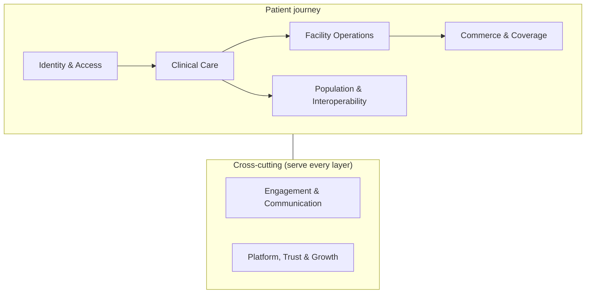
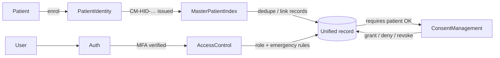
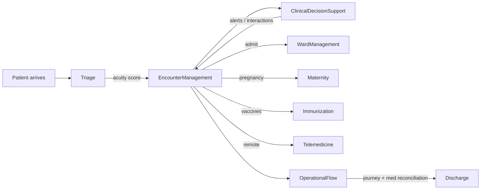
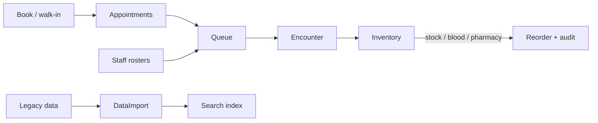
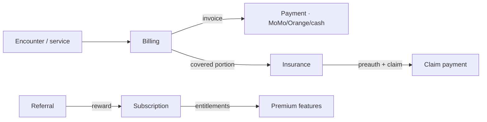
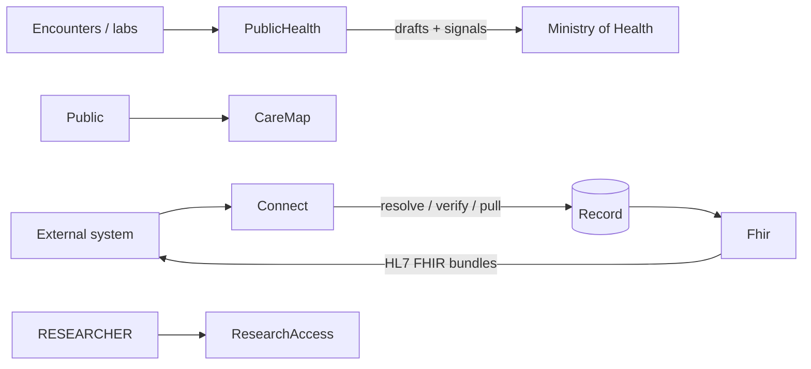
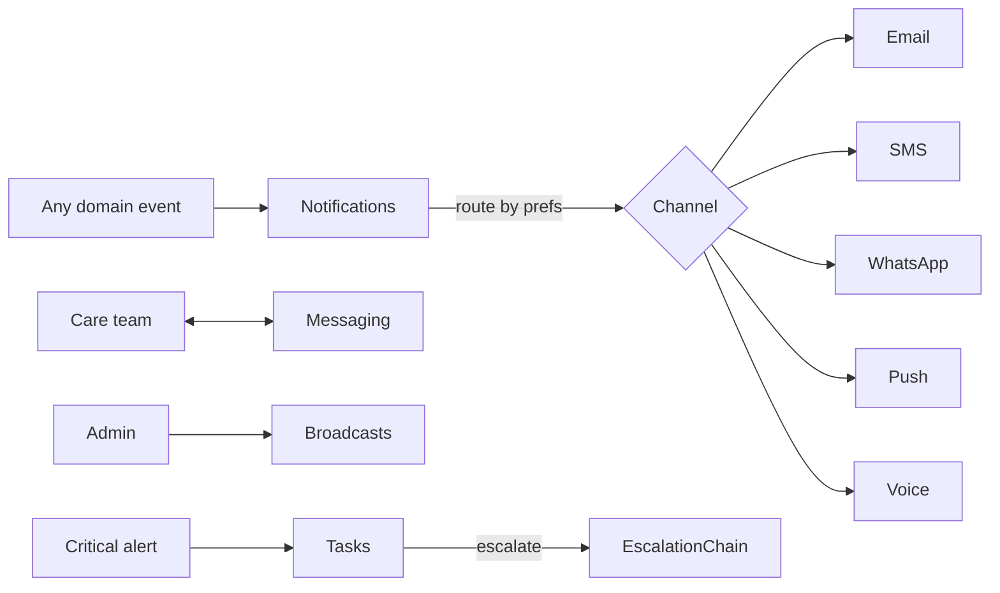
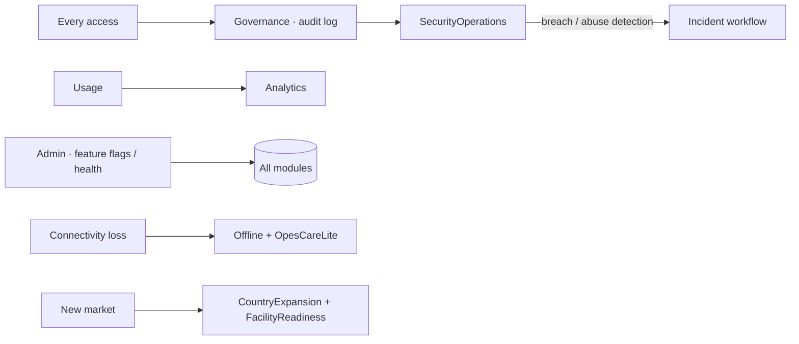
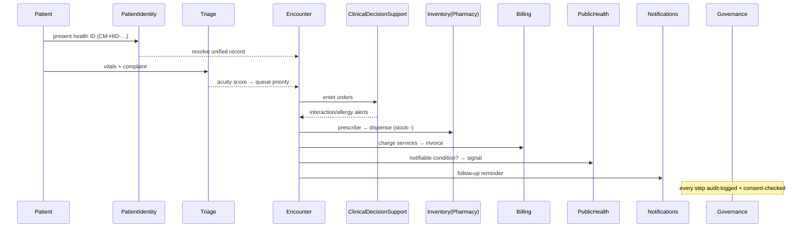

# OpesCare — Module Architecture Guide

OpesCare is a national digital health-ID and interoperability platform (Laravel 13 / PHP 8.3 / PostgreSQL, queue on Redis + Horizon). Its domain logic lives in **46 modules** under `app/Modules/`, each a self-contained set of Models + Services, surfaced through web portals (`/portals/*`) and a versioned API (`/api/v1/*`, `/api/mobile/*`).

This guide groups the 46 into **7 domains**. The first five form the **patient journey**; the last two are **cross-cutting** layers that every domain above depends on.

Legend for each entry: **Purpose** (what), **Importance** (why), **Services** (real classes), **Main flow** (the happy path).

---

## 1 · Identity & Access

*Who you are, and who is allowed to see your record.* This domain is the trust root of the whole platform — every clinical read/write is gated here.

### Auth
- **Purpose:** Authentication + two-factor (TOTP/SMS) verification for all human users.
- **Importance:** First gate; `mfa.verified` middleware protects every portal. Without it, no protected route is reachable.
- **Services:** `TwoFactorService`.
- **Main flow:** login → password check → if MFA enabled, challenge → `EnsureTwoFactorVerified` marks the session verified → portal access granted.

### AccessControl
- **Purpose:** Role/permission enforcement and **break-glass emergency access** to records.
- **Importance:** Lets a clinician reach a record in an emergency *with* a full audit trail, instead of being blocked or going around the system.
- **Services:** `EmergencyAccessService`.
- **Main flow:** clinician requests emergency access → reason captured → time-boxed grant created → every read logged → reviewed afterwards by Security Ops.

### PatientIdentity
- **Purpose:** Issues and resolves the national health ID (`CM-HID-XXXX-XXXX-XXXX`).
- **Importance:** The unique key that ties a person to their records across every facility — the product's core promise.
- **Services:** `PatientIdentityService`.
- **Main flow:** registration → demographics validated → health ID generated (country-prefixed) → QR/card issued → resolvable by any connected facility.

### MasterPatientIndex
- **Purpose:** Cross-facility patient matching, linking and de-duplication (MPI).
- **Importance:** Stops one person becoming five different records across hospitals — essential for a *national* record.
- **Services:** `MasterPatientIndexService`.
- **Main flow:** incoming patient → probabilistic match against the index → link / merge / create → identifiers reconciled.

### ConsentManagement
- **Purpose:** Patient consent grants, denials, revocations and scoped data-sharing.
- **Importance:** Legal + ethical backbone — a facility can only pull a record the patient (or a valid emergency rule) authorises.
- **Services:** `ConsentManagementService`.
- **Main flow:** facility requests access → patient approves/denies in their portal → `ConsentGrant` with scope + expiry → reads checked against it → patient can revoke anytime.

---

## 2 · Clinical Care

*The actual practice of medicine.* Encounters, decision support, and specialty pathways.

### EncounterManagement
- **Purpose:** Visits, consultations and clinical notes — the unit of clinical work.
- **Importance:** Everything clinical hangs off a visit; it's the spine of the medical record.
- **Services:** `VisitManagementService`, `ConsultationService`.
- **Main flow:** check-in → visit opened → consultation documented (notes, diagnoses, orders) → visit closed → feeds timeline, billing, public health.

### Triage
- **Purpose:** Acuity scoring and emergency-room workflow.
- **Importance:** Decides who is seen first; a safety-critical ordering of care.
- **Services:** `TriageService`, `TriageScoringService`, `EmergencyWorkflowService`.
- **Main flow:** vitals + complaint → acuity score (e.g. ESI) → priority assigned in the queue → emergency cases escalated.

### ClinicalDecisionSupport
- **Purpose:** Real-time clinical alerts, drug-interaction checks, rule evaluation, alert overrides.
- **Importance:** Catches dangerous orders (interactions, allergies, dosing) before they reach the patient.
- **Services:** `ClinicalDecisionSupportService`, `ClinicalAlertService`, `DrugInteractionService`, `RuleEvaluationService`, `AlertOverrideService`.
- **Main flow:** order entered → rules + interaction engine evaluate → alert raised (critical/warning) → clinician acts or overrides-with-reason (logged).

### WardManagement
- **Purpose:** Admissions, bed management and discharge planning.
- **Importance:** Inpatient capacity is finite and life-affecting; bed allocation must be race-safe (uses `lockForUpdate`).
- **Services:** `AdmissionService`, `WardService`, `DischargePlanningService`.
- **Main flow:** admit → bed assigned (locked) → ward rounds → discharge plan → bed freed.

### Maternity
- **Purpose:** Antenatal care and pregnancy/maternity records.
- **Importance:** Maternal mortality is a national KPI; structured ANC drives outcomes + reporting.
- **Services:** `MaternityService`, `AntenatalCareService`.
- **Main flow:** pregnancy registered → ANC visits scheduled + recorded → risk flags → delivery outcome → feeds public-health reporting.

### Immunization
- **Purpose:** Vaccine schedules, administration records and coverage.
- **Importance:** Drives immunization-coverage reporting and AEFI safety surveillance.
- **Services:** `ImmunizationService`.
- **Main flow:** schedule due → dose administered + lot recorded → next dose scheduled → coverage aggregated for PublicHealth.

### Telemedicine
- **Purpose:** Remote consultations, virtual waiting room, tele-consent.
- **Importance:** Extends care to low-access areas; consent + provider routing make it safe and billable.
- **Services:** `TelemedicineService`, `CallProviderService`, `VirtualWaitingRoomService`, `TelemedicineConsentService`.
- **Main flow:** patient requests visit → tele-consent captured → placed in virtual waiting room → provider connects → encounter recorded like any visit.

### OperationalFlow
- **Purpose:** End-to-end patient-journey orchestration + medication reconciliation across transitions.
- **Importance:** Prevents care gaps and medication errors when a patient moves between departments/facilities.
- **Services:** `PatientJourneyService`, `MedicationReconciliationService`, `VisitManagementService`.
- **Main flow:** track each step (arrival→triage→consult→pharmacy→discharge) → reconcile meds at every transition → surface bottlenecks.

---

## 3 · Facility Operations

*Running the front door and the back office of a facility.*

### Appointments
- **Purpose:** Booking, self-booking, reminders and waitlists.
- **Importance:** The scheduling layer that fills clinics and reduces no-shows.
- **Services:** `AppointmentService`, `PatientSelfBookingService`, `AppointmentReminderService`, `WaitlistService`.
- **Main flow:** patient/staff books (or joins waitlist) → reminder queued → check-in converts to a visit → no-show/cancel tracked.

### Queue
- **Purpose:** Live patient queues and waiting-room displays.
- **Importance:** Orchestrates flow inside a facility; what staff and patients watch all day.
- **Services:** `QueueService`, `QueueDisplayService`.
- **Main flow:** check-in → ticket issued into a `FacilityQueue` → called/served → display boards updated in real time.

### Staff
- **Purpose:** Staff directory, rostering and leave.
- **Importance:** You can't run queues, wards or theatres without knowing who's on shift.
- **Services:** `StaffService`, `RosterService`, `LeaveService`.
- **Main flow:** roster built → shifts assigned → leave requested/approved → availability feeds operations.

### Inventory
- **Purpose:** Pharmacy stock, blood inventory, supply chain and stock audits.
- **Importance:** Stock-outs of drugs/blood are directly life-threatening; this keeps them visible and replenished.
- **Services:** `PharmacyInventoryService`, `BloodInventoryService`, `SupplyChainService`, `StockAuditService`.
- **Main flow:** dispense/transfuse decrements stock → reorder thresholds trip → purchase/replenish → periodic audit reconciles.

### DataImport
- **Purpose:** Bulk import of legacy/external data with mapping, validation and rollback.
- **Importance:** Onboarding a facility means migrating its existing records safely and reversibly.
- **Services:** `ImportService`, `ImportMappingService`, `ImportValidationService`, `ImportRollbackService`.
- **Main flow:** upload → map columns → validate (dry-run) → commit in batches → rollback a batch if wrong.

### Search
- **Purpose:** Global, permission-aware search and indexing.
- **Importance:** Finding the right patient/record fast — gated so results respect access rules.
- **Services:** `GlobalSearchService`, `SearchIndexingService`, `SearchPermissionService`.
- **Main flow:** records indexed on change → user searches → permission filter applied → ranked results.

---

## 4 · Commerce & Coverage

*Getting paid, and managing who pays.*

### Billing
- **Purpose:** Invoices, payments (MTN MoMo / Orange Money / cash) and reconciliation.
- **Importance:** Revenue capture; the idempotency-locked payment path is a hardened, money-touching boundary.
- **Services:** `BillingService`, `PaymentService`, `PaymentReconciliationService`.
- **Main flow:** service rendered → invoice with patient-responsibility split → patient pays (Mobile Money/cash) → payment reconciled to the invoice.

### Insurance
- **Purpose:** Eligibility, pre-authorization, claims and claim payments.
- **Importance:** Most care is insurer-funded; preauth + claims are how the facility actually collects.
- **Services:** `InsuranceEligibilityService`, `PreauthorizationService`, `ClaimService`, `ClaimPaymentService`.
- **Main flow:** check eligibility → obtain preauth → deliver care → submit claim → adjudicate → claim paid.

### Subscription
- **Purpose:** B2C (patient) and B2B (org) subscription plans, entitlements, plan limits.
- **Importance:** The platform's own SaaS revenue + feature gating (free vs premium, family sharing).
- **Services:** `SubscriptionService`, `PatientSubscriptionService`, `PlanLimitService`, `ReferralRewardService`.
- **Main flow:** choose plan → free activates instantly / paid goes to MoMo checkout → entitlements resolved per request → limits enforced.

### Referral
- **Purpose:** Clinical referrals between facilities **and** growth referrals (patient-invites-patient).
- **Importance:** Continuity of care across facilities, plus a viral growth loop feeding Subscription rewards.
- **Services:** `ReferralService`.
- **Main flow:** referrer creates referral → target facility receives + accepts → care continues; growth referrals grant subscription days on both sides.

---

## 5 · Population & Interoperability

*Beyond a single facility — the nation, partners, and global standards.*

### PublicHealth
- **Purpose:** Notifiable-disease reporting, outbreak-signal detection, data-quality checks, exports.
- **Importance:** National disease surveillance — the platform's value to the Ministry of Health.
- **Services:** `SignalDetectionService`, `DraftGenerationService`, `DataQualityCheckService`, `ExportService`.
- **Main flow:** encounters aggregate → anomaly/outbreak signals detected → report drafts generated → reviewed → submitted/exported to MINSANTE/DHIS2.

### Connect
- **Purpose:** The partner-facing **Connect Suite** — health-ID resolution, verification, emergency-profile pull, scoped record access for third-party apps.
- **Importance:** The interoperability product; how external apps safely use OpesCare identities (token-throttled, consent-gated).
- **Services:** `ConnectAdminService` (+ `Api/V1/Connect/*` controllers).
- **Main flow:** partner authenticates (client creds) → resolves/verifies a health ID → pulls summary/emergency profile within granted scope → every access audited.

### Fhir
- **Purpose:** HL7 FHIR resource mapping and bundle generation.
- **Importance:** Global health-data standard — makes records portable to any FHIR-speaking system.
- **Services:** `FhirService`.
- **Main flow:** internal record → mapped to FHIR resources → assembled into a Bundle → served to external systems / exports.

### CareMap
- **Purpose:** Public facility directory + geospatial search (nearest facility, blood availability, lab tests, pharmacy stock, insurance network).
- **Importance:** Patient-facing "find care near me"; the platform's public front door.
- **Services:** `CareMapSearchService`, `GeocodingService`, `BloodAvailabilitySearchService`, `PharmacyStockSearchService`, `LabTestSearchService`, `InsuranceNetworkSearchService`, `FacilityVerificationService`, `FacilityClaimService`, `FacilityFreshnessService`, `FacilityReportService`, `MapProviderService`.
- **Main flow:** user searches by location/need → haversine distance + filters → ranked facilities (with live blood/stock/network data) → directions.

### Partners
- **Purpose:** External-organization lifecycle — applications, agreements, contributions, governance, quality/risk scoring.
- **Importance:** Governs every third party that touches the platform (NGOs, labs, insurers, vendors) with audit + risk controls.
- **Services:** `PartnerApplicationService`, `PartnerAgreementService`, `PartnerContributionService`, `PartnerVerificationService`, `PartnerPermissionService`, `PartnerIntegrationGovernanceService`, `PartnerQualityScoreService`, `PartnerRiskScoreService`, `PartnerAuditService` (14 models — the richest module).
- **Main flow:** partner applies → verified → agreement signed → scoped permissions granted → contributions tracked → quality/risk scored → governed/audited continuously.

### ResearchAccess
- **Purpose:** Governed, de-identified data access for researchers.
- **Importance:** Unlocks research value from the dataset without breaching patient privacy.
- **Services:** `ResearchAccessService`.
- **Main flow:** researcher requests dataset → governance approves scope → de-identified extract released → usage tracked.

---

## 6 · Engagement & Communication *(cross-cutting)*

*Reaching patients and staff on every channel — every domain above triggers these.*

### Notifications
- **Purpose:** Multi-channel notification engine (email, SMS, WhatsApp, push, voice), templates, preferences, delivery tracking, escalation.
- **Importance:** Almost every clinical/operational event becomes a notification; the most service-rich infra module.
- **Services:** `NotificationService`, `EmailNotificationService`, `SmsNotificationService`, `WhatsAppNotificationService`, `PushNotificationService`, `VoiceNotificationService`, `NotificationTemplateRenderer`, `NotificationPreferenceService`, `AlertEscalationService`.
- **Main flow:** event → template rendered → channels chosen per user preference → delivered async (Horizon) → delivery/read tracked → unacknowledged critical alerts escalate.

### Messaging
- **Purpose:** Secure, KMS-encrypted threaded messaging between patients and care teams (with clinical context + attachments).
- **Importance:** HIPAA-grade patient↔provider communication tied to the record.
- **Services:** `MessagingService`, `MessagePermissionService`, `MessageAttachmentService`.
- **Main flow:** thread created (optionally linked to a lab/rx/appointment) → messages KMS-encrypted at rest → permission-gated reads → attachments scanned/stored.

### Broadcasts
- **Purpose:** One-to-many announcements/alerts to audiences (all patients, facility staff, etc.) with acknowledgements.
- **Importance:** Outage notices, outbreak alerts, policy changes — fast, auditable, ack-tracked.
- **Services:** `BroadcastService`.
- **Main flow:** admin composes → draft → publish to target audience → recipients see it → acknowledgements recorded.

### Communications
- **Purpose:** Channel-routing helper that decides *how* a message reaches a recipient.
- **Importance:** Shared routing brain used by Notifications; keeps channel logic in one place.
- **Services:** `CommunicationRouterService`.
- **Main flow:** message + recipient → router picks channel(s) by availability/preference → hands off to Notifications.

### Tasks
- **Purpose:** Assignable action-tasks with acknowledge/complete/escalate lifecycle.
- **Importance:** Turns alerts and follow-ups into tracked work that can't fall through the cracks.
- **Services:** `TaskService`.
- **Main flow:** task created + assigned (user/role) → acknowledged → completed, or **escalated** up an `EscalationChain` if it stalls. *(Surfaced via the staff inbox + admin task console.)*

### Support
- **Purpose:** Help-desk tickets, assignment and a knowledge base.
- **Importance:** Operational support for facilities and developers using the platform.
- **Services:** `SupportService`, `TicketAssignmentService`, `KnowledgeBaseService`.
- **Main flow:** ticket raised → auto/assigned → resolved with KB articles → closed.

---

## 7 · Platform, Trust & Growth *(cross-cutting)*

*Security, governance, analytics, resilience and expansion — the foundation under everything.*

### Governance
- **Purpose:** Audit logging, consent records, data-export/correction rights, country policy.
- **Importance:** Regulatory compliance + the immutable audit trail behind every access (GDPR-style rights).
- **Services:** `AccessLogService`, `ConsentService`, `DataExportService`, `CorrectionRequestService`, `CountryPolicyService`, `EmergencyAccessService`.
- **Main flow:** every access logged → patient exercises data rights (export/rectify/erase) → emergency access reviewed → country-specific policy applied.

### SecurityOperations
- **Purpose:** Breach workflow, suspicious-access + API-abuse detection, access reviews, audit exploration, compliance exports.
- **Importance:** Active defense + incident response for a national PHI dataset.
- **Services:** `SecurityIncidentService`, `BreachWorkflowService`, `SuspiciousAccessDetectionService`, `ApiAbuseDetectionService`, `AccessReviewService`, `AuditExplorerService`, `ComplianceExportService`.
- **Main flow:** signals/anomalies detected → incident opened → triaged → contained → compliance export for regulators.

### Analytics
- **Purpose:** Operational + product analytics and report export.
- **Importance:** Tells operators and the company how the platform is performing.
- **Services:** `OperationalAnalyticsService`, `ProductAnalyticsService`, `ReportExportService`.
- **Main flow:** events/metrics aggregated → dashboards → exportable reports.

### Admin
- **Purpose:** Platform control center — feature flags, system health, platform administration.
- **Importance:** The god-mode console (platform-tier only) to operate and toggle the whole system.
- **Services:** `PlatformAdminService`, `FeatureFlagService`, `SystemHealthService`.
- **Main flow:** platform admin toggles features / inspects health / manages tenants from the Control Center.

### FileStorage
- **Purpose:** Secure document/file storage abstraction.
- **Importance:** Lab PDFs, scanned docs, attachments — stored once, served safely everywhere.
- **Services:** `FileStorageService`.
- **Main flow:** upload → stored on the configured disk → access-checked retrieval/download.

### Offline
- **Purpose:** Offline-first sync and conflict resolution for low-connectivity sites.
- **Importance:** Care can't stop when the internet does; this reconciles when it returns.
- **Services:** `SyncService`, `ConflictResolutionService`, `OfflinePolicyService`.
- **Main flow:** device works offline → captures events → on reconnect, syncs → conflicts resolved by policy.

### OpesCareLite
- **Purpose:** Stripped-down, large-button portal for small/low-connectivity facilities (device management, sync conflicts).
- **Importance:** Brings the smallest clinics onto the network with a lightweight UI.
- **Services:** `OpesCareLiteService`.
- **Main flow:** lite device activated → simplified register/check-in/consult/bill → syncs to the core platform.

### Legal
- **Purpose:** Legal document management (terms, policies, re-acceptance).
- **Importance:** Enforces consent to current legal terms before sensitive actions.
- **Services:** `LegalDocumentService`.
- **Main flow:** new policy version published → users prompted to re-accept → acceptance recorded.

### FacilityReadiness
- **Purpose:** Go-live checklist + readiness scoring for onboarding facilities.
- **Importance:** Ensures a facility is actually ready (staff, data, config) before it goes live.
- **Services:** `FacilityGoLiveService`, `FacilityReadinessScoringService`.
- **Main flow:** checklist items completed → readiness scored → go-live approved when thresholds met.

### CountryExpansion
- **Purpose:** Multi-country launch approvals and per-country configuration.
- **Importance:** The path from one country to many — country-specific rules, IDs, policies.
- **Services:** `CountryExpansionService`.
- **Main flow:** country launch initiated → compliance checklist → approved → country activated with its config.

### Academy
- **Purpose:** Training courses, quizzes, simulations, competency gating and certification.
- **Importance:** Staff competency is a clinical-safety control; certificates can gate who may perform what.
- **Services:** `CourseService`, `EnrollmentService`, `QuizService`, `SimulationService`, `CompetencyGateService`, `CertificateService`, `CertificateVerificationService`, `AcademyReportingService`.
- **Main flow:** enrol → learn → quiz/simulation → competency gate passed → certificate issued + verifiable.

---

## How the layers fit together (one example)

A single ER visit touches most of the platform:

---

## Quick reference

| Domain | Modules | Count |
|---|---|---|
| Identity & Access | Auth, AccessControl, PatientIdentity, MasterPatientIndex, ConsentManagement | 5 |
| Clinical Care | EncounterManagement, Triage, ClinicalDecisionSupport, WardManagement, Maternity, Immunization, Telemedicine, OperationalFlow | 8 |
| Facility Operations | Appointments, Queue, Staff, Inventory, DataImport, Search | 6 |
| Commerce & Coverage | Billing, Insurance, Subscription, Referral | 4 |
| Population & Interoperability | PublicHealth, Connect, Fhir, CareMap, Partners, ResearchAccess | 6 |
| Engagement & Communication | Notifications, Messaging, Broadcasts, Communications, Tasks, Support | 6 |
| Platform, Trust & Growth | Governance, SecurityOperations, Analytics, Admin, FileStorage, Offline, OpesCareLite, Legal, FacilityReadiness, CountryExpansion, Academy | 11 |
| **Total** | | **46** |

*Generated from the live `app/Modules/` tree (models + services per module). The Mermaid diagrams render on GitHub and in most Markdown viewers; the inline SVG system map is in the architecture overview.*
