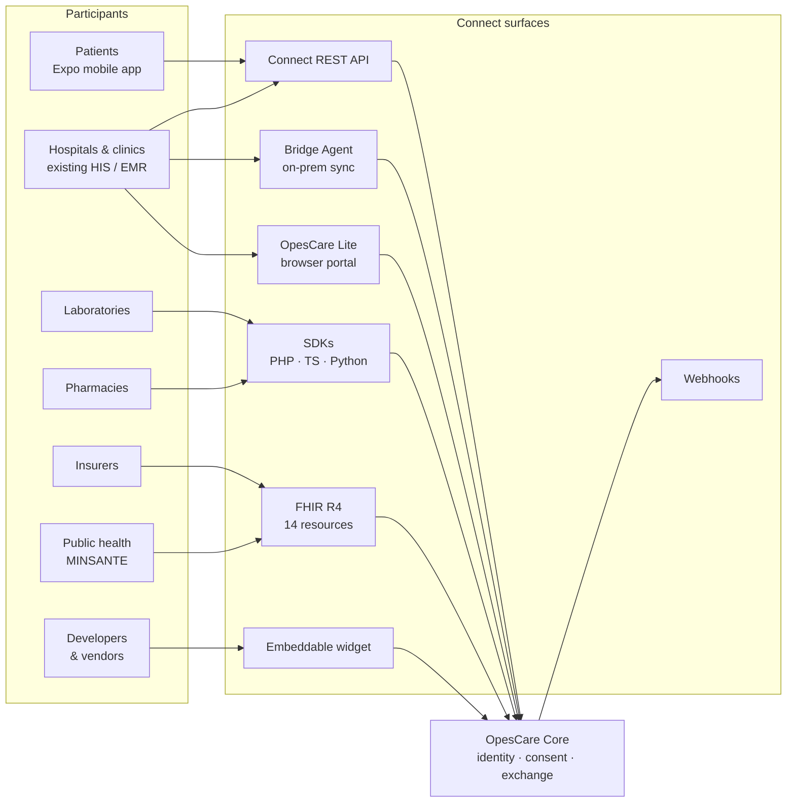
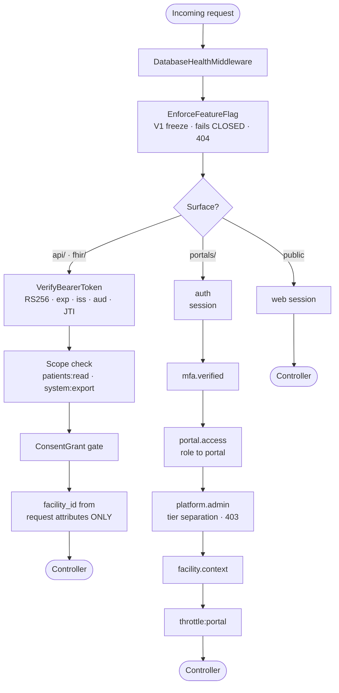
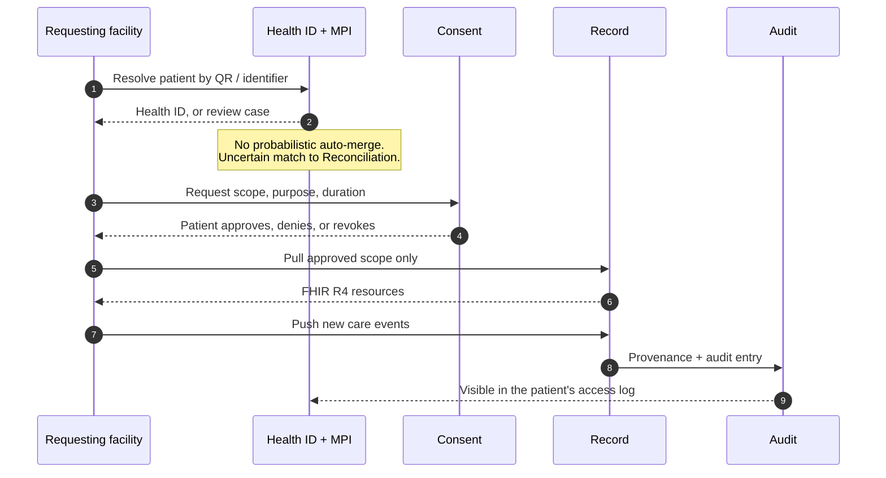
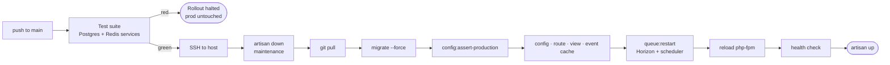

# OpesCare — Platform Architecture

> A patient-centred health identity and interoperability layer for Cameroon, built
> multi-country and bilingual. One portable Health ID, one longitudinal record,
> exchanged under consent between the systems facilities already run — **not** a
> hospital management system every site must adopt.

**Every figure in this document was counted from the running system on 2026-09-01.**
Where this document and the code disagree, the code is right — fix the document.

| Domain modules | Routes | Tables | Models | Migrations | Tests |
|---:|---:|---:|---:|---:|---:|
| **45** | **1,248** | **523** | **485** | **208** | **1,008** |

---

## Contents

1. [System context](#01--system-context)
2. [Request lifecycle](#02--request-lifecycle)
3. [Identity, consent, exchange](#03--identity-consent-exchange)
4. [Application layer](#04--application-layer)
5. [Presentation](#05--presentation)
6. [Integration surfaces](#06--integration-surfaces)
7. [Runtime & delivery](#07--runtime--delivery)
8. [Invariants](#08--invariants)

---

## 01 — System context

Every participant reaches the platform through the surface that fits them. A hospital
keeps its existing HIS and connects over the API; a facility with no system at all uses
OpesCare Lite in a browser; a patient uses the mobile app. Nobody is asked to migrate.



*Fig. 1 — Participants never integrate with each other, only with the core. Seven connect
surfaces, one identity layer.*

### The monorepo

| Path | What it is | Deployed to prod |
|---|---|---|
| `apps/api-laravel` | **The platform** — Laravel 13 / PHP 8.3. REST + FHIR API *and* the server-rendered Blade portals | ✅ yes |
| `apps/mobile-expo` | Patient app — Expo / React Native, expo-router, NativeWind | via EAS, separately |
| `sdk/{php,typescript,python}` | Connect SDKs for integration partners | no |
| `widget/` | Embeddable Connect widget | no |
| `bridge-agent/` | On-prem facility data-sync agent | to facilities, not the API host |
| `contracts/` | Hand-authored API / integration contracts | no |
| `deploy/` | systemd units + deploy notes | ops only |

---

## 02 — Request lifecycle

Two distinct chains. A partner system authenticates as a machine and is scoped by
consent; a human authenticates as a person and is scoped by role, facility and tier.
They share almost nothing, which is deliberate.



*Fig. 2 — The freeze runs before authentication: a module switched off is invisible to
everyone, authenticated or not.*

### Middleware aliases

| Alias | Enforces | Fails |
|---|---|---|
| `auth.bearer` | RS256 JWT — signature, expiry, issuer, audience, JTI revocation | 401 |
| `verify.integration.client` | Client ID + secret, Argon2id with SHA-256 rolling upgrade | 401 |
| `consent.grant` | A ConsentGrant row exists for this patient × facility | 403 |
| `portal.access` | Role belongs to the requested portal | redirect |
| `platform.admin` | Platform tier vs facility tier | 403 |
| `facility.context` | An active facility is selected | redirect |
| `feature` | V1 launch scope — kill switch, fails **closed** | 404 |
| `module` | Subscription entitlement — fails **open** | pass-through |
| `patient.feature` | Patient's own plan, honouring family sharing | 403 |

> ⚠️ **`feature` vs `module`.** They look alike and behave oppositely. `feature` is the
> launch-scope kill switch and fails *closed* with 404 — a frozen module must not
> advertise that it exists. `module` is a subscription gate and fails *open*, calling the
> next handler when no organisation or subscription resolves. Using `module` to freeze
> something would leave it wide open.

---

## 03 — Identity, consent, exchange

The core loop, and the reason the platform exists. Identity resolution never guesses: an
uncertain match goes to human review rather than silently linking two people's medical
histories.



*Fig. 3 — Consent is checked per exchange, not once per relationship. Every access lands
in a log the patient can read.*

### Break-glass

When consent cannot be obtained, an approved provider can open a limited emergency
profile — identity, blood group, allergies, active conditions, current medication,
emergency contact. It requires a stated reason, notifies the patient, and is reviewed
afterwards. That notification is a legal obligation under **Cameroon Law No. 2010/012**,
not a courtesy.

### The two-facility split

The single most load-bearing shape in the data model, and the source of most confusion:

| Table | Rows | Role |
|---|---:|---|
| `care_facilities` | 903 | Public directory — the real MINSANTE / ONPC registry, carries GPS. What a patient searches. |
| `facilities` | 482 | Operational tenant — who logs in, owns staff and records. No location columns. |
| `facility_registry` | 903 | Claimable registry entries linking the two. |

> **A facility can exist in one and not the other.** A pharmacy in the public directory
> with no operational tenant is findable but cannot report its own stock; a tenant with no
> directory listing can report but is invisible to patients. Availability projections are
> keyed on `care_facilities.id`, operational inventory on `facilities.id` — mixing them up
> is the classic bug here.

---

## 04 — Application layer

45 domain modules under `app/Modules/`, with cross-cutting logic in 65 service classes.
Seven modules are frozen out of the V1 launch scope — present, migrated, tested, and
switched off at the edge.

**Identity & trust — the core**
`PatientIdentity` · `MasterPatientIndex` · `ConsentManagement` · `AccessControl` · `Auth` ·
`Governance` · `SecurityOperations` · `Legal`

**Interoperability — the product**
`Fhir` · `Connect` · `Partners` · `DataImport` · `Offline` · `OpesCareLite` · `Search` ·
`FileStorage`

**Clinical record**
`EncounterManagement` · `Appointments` · `Referral` · `Maternity` · `Immunization` ·
`Triage` · `Queue` · `WardManagement` · `OperationalFlow` · ❄️ `ClinicalDecisionSupport`

**Network & discovery**
`CareMap` · `Pharmacy` · `FacilityReadiness` · ❄️ `Inventory`

**Coverage & money**
❄️ `Insurance` · ❄️ `Billing` · `Subscription`

**Communications & support**
`Notifications` · `Messaging` · `Communications` · `Broadcasts` · `Support` · `Tasks`

**Population & platform**
`PublicHealth` · `ResearchAccess` · `CountryExpansion` · `Admin` · `Staff` · ❄️ `Analytics`

❄️ = frozen out of V1

### V1 launch scope

| Flag | State | Why |
|---|---|---|
| `insurance_coverage` | 🟢 live | Read-only coverage is an attribute of the Health ID and travels with the patient. No write path, no money. |
| `insurance` | ❄️ frozen | Claims are a money workflow. Cameroonian payers expose no APIs to settle against — shipping it means shipping data entry, not exchange. |
| `insurance_marketplace` | ❄️ frozen | Commercial ambiguity; zero plans in the database. |
| `billing` | ❄️ frozen | Facility-internal invoicing — internal ops, not cross-system exchange. Platform revenue is unaffected. |
| `inventory_ops` | ❄️ frozen | Facility stock management. The medicine and blood *finders* ship — they are the interoperability product. |
| `clinical_decision_support` | ❄️ frozen | Clinical-safety liability the platform is not yet able to carry. |
| `analytics_dashboards` | ❄️ frozen | Dashboards over thin coverage mislead more than they inform. Statutory MINSANTE reporting stays live. |
| `telemedicine_full` | ❄️ frozen | Waiting-room and video orchestration. The thin book → consult path stays in. |

> **Freezing is not deleting.** No route file is removed, no migration rolled back, no
> seeded institutional data touched. Flip a flag and the module returns intact — including
> its navigation, because nav entries are gated by the same flag through the `@feature`
> Blade directive.

---

## 05 — Presentation

Server-rendered Blade, no SPA. Nine portals, driven entirely by role: a role names a
dashboard profile, the profile names a sidebar partial, and the layout renders it.

| Portal | Routes | For |
|---|---:|---|
| `portals/admin` | 144 | Facility administration, and — behind a separate tier gate — the platform console |
| `portals/staff` | 117 | Clinicians, nursing, front desk, records |
| `portals/patient` | 73 | Patients, guardians, caregivers |
| `portals/insurance` | 20 | Insurers ❄️ frozen |
| `portals/developer` | 15 | Apps, keys, production requests, webhook deliveries |
| `portals/lite` | 14 | Facilities with no system of their own, low connectivity |
| `portals/healthorg` | 11 | NGOs and health programmes |
| `portals/lab` | 8 | Laboratories |
| `portals/pharmacy` | 7 | Pharmacies |

82 roles map onto 59 dashboard profiles and 43 sidebar partials. Two Blade conditionals
keep navigation honest: `@feature` hides links into frozen modules, and `@platformadmin`
hides links into platform-tier pages. Both delegate to the same predicates the middleware
uses, so nav and enforcement cannot drift apart.

> **Every screen is bilingual.** Strings resolve through `__('namespace.key')`; `lang/en`
> and `lang/fr` are kept strictly 1:1 — 8,214 keys, enforced in CI. Status and severity
> values render through an `@enum` directive rather than being written out in English.

---

## 06 — Integration surfaces

Five ways in, chosen by what a facility already has rather than what it should have.

| Surface | Auth | For |
|---|---|---|
| **Connect REST API** (89 routes) | Client ID + Argon2id secret → RS256 bearer | Vendors and hospitals wanting direct system-to-system integration |
| **FHIR R4** (35 routes) | Bearer, SMART-style scopes | Patient, Encounter, DiagnosticReport, MedicationRequest, Immunization, AllergyIntolerance, Condition, Consent, Coverage, DocumentReference, Practitioner, Organization, Subscription, Bulk Data |
| **SDKs** | SDK token | PHP, TypeScript, Python |
| **Connect Widget** | Session token | Embeddable patient search, consent, pull and push |
| **Bridge Agent** | Agent credential | Legacy systems, file exports, local databases, offline sync |
| **OpesCare Lite** | Portal session | Facilities with no digital system at all |
| **Webhooks** | HMAC-SHA256 signature | Outbound events, scoped per facility and replayable only by the owning client |

Mobile has its own surface — 89 routes under `api/mobile`, authenticated as a patient
rather than as a machine. The generated OpenAPI description covers **626 operations**,
which is 100% of the live route table.

> 🔒 **Sealed modules.** The Health ID and interoperability security surface — bearer token
> verification, integration client auth, FHIR controllers, bulk export, JWT service, the
> API route file — is audited and sealed against ISO 27001, ISO 27799, HL7 FHIR R4, the
> OWASP API Top 10 and Cameroon Law No. 2010/012. Those files carry an explicit
> prohibition on unattended modification. See `apps/api-laravel/CLAUDE.md`.

---

## 07 — Runtime & delivery

PostgreSQL is the system of record. A push to `main` deploys, and a red test halts the
rollout before production is touched.



*Fig. 4 — Migrations run inside maintenance mode, before the caches are rebuilt, so the
schema is never behind the code.*

| Concern | Production |
|---|---|
| System of record | PostgreSQL 16 |
| Queue, cache, sessions | Redis, with Horizon under systemd (`opescare-horizon.service`) |
| Scheduler | systemd timer (`opescare-scheduler.timer`) — 27 console commands |
| Error tracking | Sentry, DSN-gated, PHI scrubbed before send |
| Nightly jobs | JTI blacklist purge, bulk-export cleanup, audit archiving on a 7-year retention, MINSANTE monthly report, Health ID expiry notices |

Local development uses database drivers for queue, cache and session rather than Redis;
Horizon is a production concern.

---

## 08 — Invariants

These are not conventions. Breaking one is a correctness, safety or legal defect, and each
is enforced somewhere in the codebase rather than trusted to discipline.

| # | Invariant | What it means |
|---|---|---|
| **I** | **`facility_id` has one source** | Only from `$request->attributes`, set by auth middleware. Never a header, body, query string, session or fallback. Any other source reintroduces cross-facility IDOR. |
| **II** | **Identity writes are centralised** | Patients are created only through `PatientIdentityService`. No module calls `Patient::create` directly. |
| **III** | **No probabilistic auto-merge** | An uncertain identity match goes to the Reconciliation / MPI review path. Two people's records are never silently joined. |
| **IV** | **Clinical events are immutable** | Released labs, dispenses, claims, invoices and audit rows are amended, voided, reversed or marked entered-in-error — never hard-overwritten. |
| **V** | **External writes are idempotent** | Partner writes require an `Idempotency-Key`. Same key and hash returns the same result; same key, different hash returns 409. |
| **VI** | **No patient enumeration** | FHIR search rejects `family` and `given` parameters. Exact identifier lookups only. |
| **VII** | **Consent gates every patient endpoint** | Absence of a ConsentGrant row means the requesting facility has no right to that record. Checked per call. |
| **VIII** | **Secrets are Argon2id** | Client secrets hash with `Hash::make()`. The SHA-256 column exists only for rolling migration and is never written by new code. |
| **IX** | **Enums are not strings** | Verification, identity and audit statuses are typed backed enums. Comparing one to a string literal is always false — use `match()`, `->value`, or a helper. |
| **X** | **Postgres, not MySQL** | `TO_CHAR(col,'YYYY-MM')`, never `DATE_FORMAT`. |
| **XI** | **Every feature is navigable** | A route needs a nav link and a route-list check. A page reachable only by URL is not shipped — and a nav link the user cannot open is a defect, enforced by a test that drives all 40 role sidebars. |
| **XII** | **Nothing is monolingual** | Every user-facing string resolves through the translation layer, and EN/FR parity is a hard gate, not a cleanup task. |

---

## Verify before trusting this document

```bash
php artisan test
php scripts/i18n-audit.php
php artisan route:cache
php artisan view:cache
```

---

*Opes Health Systems Sarl · counted from the running system 2026-09-01*
*Where this document and the code disagree, the code is right — fix the document.*
